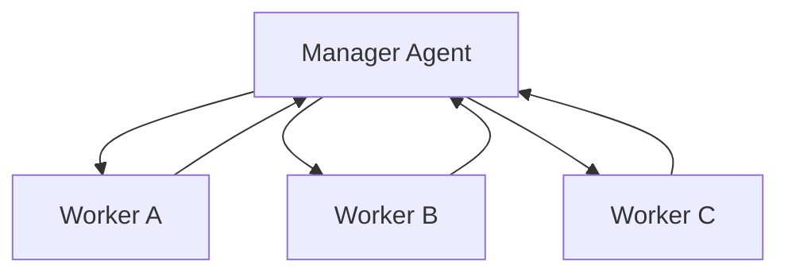
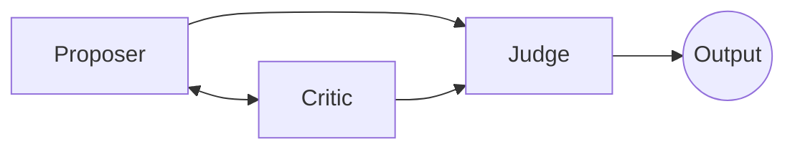
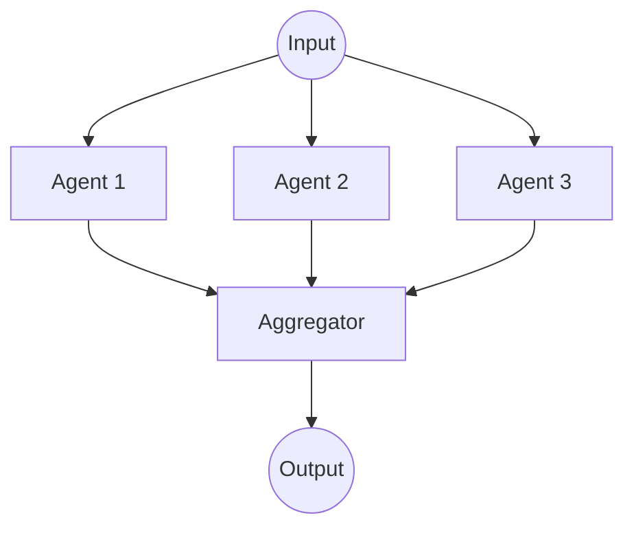
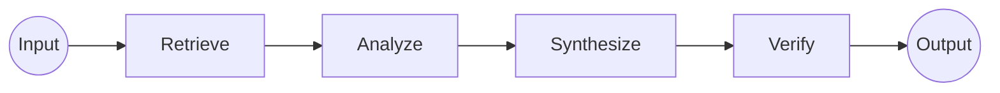
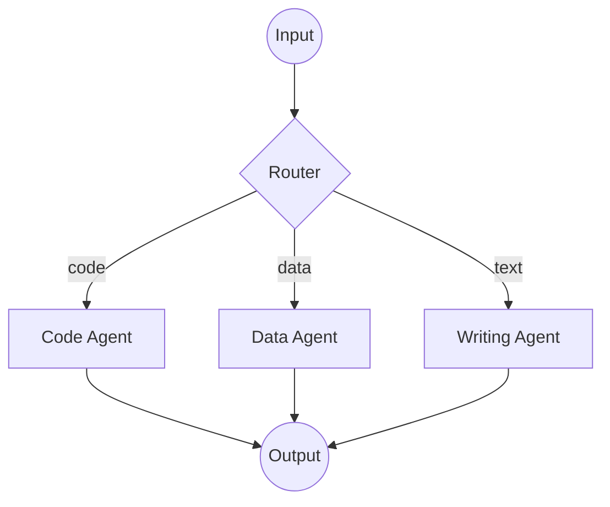
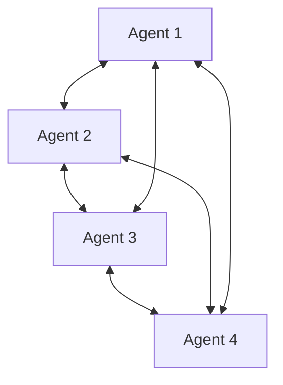
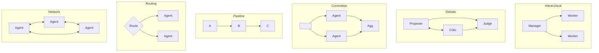

# Multi-Agent AI: Architectures for Collaborative Intelligence

## Introduction

Multi-agent AI represents a fundamental shift in how we design intelligent systems. Rather than building ever-larger monolithic models, multi-agent approaches distribute intelligence across specialized, coordinating components.

**Formal Definition:** Multi-agent AI is a computational paradigm where two or more autonomous AI agents—each with distinct roles, capabilities, or knowledge domains—coordinate, collaborate, or compete to achieve individual or collective goals through structured interaction protocols.

The underlying insight is that intelligence often emerges not from a single system, but from the interplay between specialized components. Human organizations don't rely on one person doing everything—they employ specialists who coordinate, debate, verify each other's work, and collectively produce outcomes none could achieve alone. Multi-agent AI applies this same principle to artificial intelligence.

### Why Multi-Agent Architectures Matter

Single AI agents, no matter how capable, face inherent limitations. They struggle with tasks that require diverse expertise, extended context, or parallel processing of complex workflows. Multi-agent systems address these constraints in several ways.

**Specialization enables expertise.** A single model attempting to handle coding, legal analysis, customer support, and creative writing will inevitably compromise on depth in each domain. Multi-agent systems allow each agent to be optimized for a specific function—one agent retrieves information, another analyzes it, a third verifies conclusions. This mirrors how effective human teams operate.

**Collaboration reduces errors.** When agents cross-check each other's outputs, they catch mistakes that individual agents would miss. This is particularly valuable in high-stakes domains like healthcare, legal compliance, and financial services where accuracy is paramount.

**Scale becomes manageable.** Complex tasks that would overwhelm a single agent's context window can be decomposed across multiple agents, each maintaining focused context for its subtask. The system handles complexity through coordination rather than brute-force capacity.

### Real-World Applications

Multi-agent systems are already transforming industries. In financial services, banks have deployed multi-agent fraud detection systems with specialized agents focusing on geographic anomalies, spending pattern analysis, and merchant verification—working together to achieve detection accuracy above 95% while dramatically reducing false positives.

Insurance companies are processing claims through seven-agent pipelines: a planner agent initiates the workflow, a coverage agent verifies policy details, a weather agent confirms reported events, a fraud agent checks for anomalies, and a payout agent determines amounts—reducing processing time by up to 80%.

Amazon's warehouse operations represent one of the most visible multi-agent deployments, with hundreds of Kiva robots operating as agents that retrieve items, while task allocation agents manage assignments and traffic management agents prevent collisions—all coordinating in real-time.

The major AI platforms have embraced multi-agent architectures in their flagship products. OpenAI's ChatGPT agent combines multiple specialized capabilities—Operator's web browsing, Deep Research's information synthesis, and code execution—into a unified system that can handle complex, multi-step tasks. Anthropic's Claude Code uses agent spawning patterns where subtasks are delegated to specialized agents with focused context. These aren't experimental features—they're core to how the most advanced AI products operate today.

### The Ecosystem of Frameworks

A rich ecosystem of frameworks has emerged to help developers build multi-agent systems. LangGraph provides graph-based orchestration for complex, stateful workflows. Microsoft's AutoGen focuses on enterprise-grade multi-agent conversations with robust error handling. CrewAI offers an intuitive role-based approach where agents operate like team members with defined responsibilities. OpenAI's Agents SDK and Anthropic's Claude Agent SDK provide the building blocks for custom agent development. The Model Context Protocol (MCP) has emerged as an open standard for connecting agents to external tools and data sources, adopted by both Anthropic and OpenAI.

### Early Days, Rapid Evolution

Despite these advances, we are in the early stages of multi-agent AI. A 2025 Gartner survey found that only 15% of IT leaders are considering, piloting, or deploying fully autonomous AI agents, and 74% view agents as a new attack vector requiring careful governance. Many organizations attempting to build sophisticated agentic architectures on their own are finding the complexity daunting—these systems require diverse models, sophisticated retrieval stacks, and specialized expertise.

The obstacles are real: coordination between agents remains difficult, debugging emergent behavior is challenging, and security implications of autonomous agents acting in the world are not fully understood. Unpredictable interactions between independently-acting agents can produce outcomes that are hard to anticipate or control.

Yet the trajectory is clear. The global market for agentic AI tools is projected to grow at over 50% annually. As models become more capable, as frameworks mature, and as organizations develop expertise, multi-agent architectures will become the standard approach for complex AI applications. Understanding these patterns now—how agents can coordinate, what tradeoffs different architectures make, where the boundaries lie—positions you to build and deploy these systems effectively.

---

## Architecture 1: Hierarchical (Manager-Worker)

### Overview

The hierarchical pattern establishes a clear chain of command where a manager agent decomposes complex tasks into subtasks and delegates them to specialized worker agents. The manager orchestrates the workflow, handles dependencies between tasks, and synthesizes results into a coherent output.

### How It Works

The manager agent receives a high-level goal and performs task decomposition—breaking the problem into discrete, manageable units. It then assigns each subtask to the most appropriate worker agent based on capability matching. Workers execute independently and return results to the manager, who integrates them, handles any conflicts or gaps, and produces the final output.

### Real-World Analogies

This mirrors how research laboratories operate. A principal investigator doesn't run every experiment personally—they coordinate specialists in statistics, data collection, wet lab work, and analysis. Similarly, a software development team has a tech lead who breaks down features into tickets and assigns them to developers with the right expertise.

### Strengths

The clear command structure makes debugging and auditing straightforward. Task decomposition allows for parallel execution of independent subtasks. The pattern scales well for problems that can be cleanly partitioned, and it's relatively easy to add new worker agents as specialists.

### Weaknesses

The manager agent becomes a single point of failure and a potential bottleneck. If the manager misunderstands the problem or decomposes it poorly, the entire system fails regardless of how capable the workers are. Communication overhead between manager and workers can become significant, and workers have limited autonomy to adapt when they encounter unexpected situations.

### Implementation Considerations

Effective hierarchical systems require robust task decomposition strategies, clear interfaces between manager and workers, and mechanisms for workers to escalate issues they cannot resolve. The manager should also implement progress monitoring and be able to reassign tasks if a worker fails or becomes unresponsive.

---

## Architecture 2: Debate (Adversarial)

### Overview

The debate architecture embraces conflict as a mechanism for improving reasoning quality. Multiple agents take opposing positions, critique each other's arguments, and identify logical flaws. Rather than seeking consensus directly, the system uses structured disagreement to stress-test conclusions.

### How It Works

Typically, one agent proposes a solution or makes an argument. A second agent acts as devil's advocate, actively searching for weaknesses, counterexamples, and logical gaps. Additional agents might take other perspectives or act as judges who evaluate the arguments. The process iterates until the agents reach a defensible conclusion or the allocated rounds are exhausted.

### Real-World Analogies

This mirrors adversarial processes that humans have developed to find truth: legal trials with prosecution and defense, peer review in academic publishing, red team/blue team exercises in security, and the scientific method's emphasis on falsification. The Socratic method of teaching through questioning follows similar principles.

### Strengths

Debate architectures excel at reducing overconfidence and catching errors that a single agent might miss. They produce more robust conclusions because ideas must survive active scrutiny. The process generates explicit reasoning traces that make the system's logic auditable and transparent.

### Weaknesses

The computational cost is significant—you're running multiple inference passes with agents actively constructing arguments against each other. The system can get stuck in unproductive loops where agents argue past each other. There's also risk of false balance, where a weak position is given undue weight simply because the architecture requires opposition.

### Implementation Considerations

Effective debate systems need clear termination conditions, skilled judge agents that can evaluate argument quality rather than just counting points, and careful prompt design that encourages substantive engagement rather than rhetorical tricks. The debate format should match the problem type—some questions benefit from adversarial testing while others don't.

---

## Architecture 3: Mixture of Agents (Committee)

### Overview

The mixture of agents pattern runs multiple agents on the same problem independently, then aggregates their outputs through voting, averaging, weighted combination, or a meta-agent that synthesizes perspectives. The philosophy is that diverse approaches to the same problem will make different mistakes, and aggregation smooths out individual weaknesses.

### How It Works

Each agent in the committee processes the input independently, potentially with different prompts, different fine-tuning, different retrieval sources, or even different base models. Their outputs are collected and combined through an aggregation strategy. Simple approaches use majority voting or averaging. More sophisticated approaches use a meta-agent that reads all outputs and produces a synthesis, or learned weighting based on each agent's historical accuracy for different query types.

### Real-World Analogies

This is how expert panels operate—consulting multiple specialists and taking the consensus view or the most well-supported position. Ensemble methods in machine learning follow the same principle: random forests aggregate many decision trees, and model ensembles combine predictions from different architectures. Wisdom of crowds phenomena demonstrate that aggregated judgments often outperform individual experts.

### Strengths

Diversity in the committee provides robustness against individual failures. The approach is inherently parallelizable since agents work independently. It's particularly effective when reliability matters more than finding a single brilliant insight, and when you can't easily determine in advance which agent will perform best on a given query.

### Weaknesses

Running multiple agents multiplies computational cost. The aggregation strategy matters enormously—naive voting can amplify shared biases rather than canceling them out. The approach may produce mediocre consensus rather than surfacing the best individual answer. Diversity must be genuine; running the same model multiple times with the same prompt provides little benefit.

### Implementation Considerations

Committee composition should maximize meaningful diversity—different model architectures, different training data, different prompting strategies, or different knowledge sources. The aggregation mechanism should be matched to the task: voting works for classification, but synthesis may be needed for generation. Consider confidence-weighted aggregation where agents that are more certain get more influence.

---

## Architecture 4: Sequential Pipeline (Relay)

### Overview

The sequential pipeline arranges agents in a chain where each performs a specialized transformation before passing results to the next. This is the assembly line of AI architectures—each station handles one specific operation, and the workpiece moves through in order.

### How It Works

A typical pipeline might flow: Retrieval Agent → Analysis Agent → Synthesis Agent → Verification Agent → Output Formatting Agent. Each agent is optimized for exactly one transformation. The output schema of each agent matches the expected input schema of the next. The pipeline processes requests end-to-end with minimal branching or backtracking.

### Real-World Analogies

Manufacturing assembly lines operate this way, with each station adding or transforming components. Document processing workflows follow similar patterns: intake, classification, extraction, validation, storage. The Unix philosophy of small programs that do one thing well and pipe data between them embodies this architecture.

### Strengths

Extreme specialization allows each agent to be highly optimized for its specific task. The architecture is conceptually simple and easy to reason about. Each stage can be independently tested, monitored, and improved. Bottlenecks are easy to identify—whichever stage has the longest processing time limits throughput.

### Weaknesses

Fragility is the primary concern—if any agent in the chain fails, the entire pipeline breaks. Errors propagate and potentially compound as they move through stages. The architecture handles branching logic poorly and can't easily adapt to queries that don't fit the expected flow. Latency is the sum of all stages, which can become significant for long pipelines.

### Implementation Considerations

Each interface between agents must be carefully specified. Error handling should include both retry logic and graceful degradation. Consider adding validation checkpoints that can catch problems before they propagate further. Monitoring should track not just end-to-end success but per-stage metrics. Some pipelines benefit from feedback loops where later stages can trigger re-processing of earlier stages.

---

## Architecture 5: Dynamic Routing (Orchestrated Selection)

### Overview

Dynamic routing uses a meta-agent or routing system to select which agent or agents should handle each request. Rather than running every agent on every query, the system intelligently matches problems to the most appropriate solvers based on query characteristics, agent capabilities, and current context.

### How It Works

The routing layer analyzes incoming requests and classifies them along relevant dimensions: topic domain, complexity, required capabilities, urgency, and similar factors. It maintains a registry of available agents with their capabilities, performance characteristics, and current availability. Based on this matching, it dispatches requests to selected agents. For complex queries, it might invoke multiple agents in sequence or parallel, then aggregate results.

### Real-World Analogies

Hospital triage exemplifies this pattern—not every patient sees every specialist. The triage system determines who needs emergency intervention, who needs a particular specialty, and who can be handled by general care. Customer service routing works similarly, directing calls to agents based on issue type and agent expertise. Operating system schedulers route processes to appropriate CPU cores.

### Strengths

Efficient resource utilization—you're not paying for agents that won't contribute to a particular query. Response quality improves because queries go to the most capable handlers. The system can gracefully handle heterogeneous query loads. New specialist agents can be added without modifying the core system.

### Weaknesses

The routing layer itself becomes critical infrastructure that must be highly reliable and accurate. Poor routing decisions waste resources or produce poor results. The system requires good metadata about agent capabilities, which must be maintained as agents evolve. Routing logic can become complex when queries don't fit neatly into categories.

### Implementation Considerations

The router needs robust classification capabilities—this might be a trained classifier, an LLM with capability descriptions, or rule-based logic. Agent capability descriptions should be empirically validated, not just self-reported. Consider fallback strategies for queries that don't match any specialist well. Implement feedback loops where routing decisions are evaluated against outcomes to improve future routing.

---

## Architecture 6: Collaborative Network (Society)

### Overview

The collaborative network is the most open-ended pattern. Agents exist in a persistent environment where they can communicate freely, form ad-hoc teams, share information, and collectively evolve solutions through emergent behavior. Rather than following predetermined workflows, agents negotiate, form coalitions, and build on each other's work organically.

### How It Works

Agents operate with significant autonomy within a shared environment. They can broadcast discoveries, request help from other agents, form temporary working groups, and contribute to shared knowledge repositories. Coordination emerges from local interactions rather than central control. The environment typically provides communication channels, shared memory or blackboard systems, and mechanisms for agents to discover each other's capabilities.

### Real-World Analogies

Scientific research communities operate this way—researchers publish findings, others build on them, collaborations form organically around interesting problems, and knowledge accumulates through distributed effort. Open source software development, market economies, and social networks all exhibit similar emergent coordination patterns.

### Strengths

This architecture has the highest potential for emergent intelligence—solutions can arise that no single designer anticipated. It's highly adaptable to novel problems because agents can form new combinations as needed. The decentralized structure is resilient to individual failures. Complex problems can attract resources organically as agents recognize opportunities to contribute.

### Weaknesses

Emergent behavior is inherently difficult to control and predict. The system can produce surprising results—both breakthrough insights and unexpected failures. Coordination overhead can become significant. Without careful design, agents may duplicate effort, work at cross-purposes, or converge on suboptimal equilibria. Debugging and auditing are challenging when behavior emerges from many interactions.

### Implementation Considerations

The environment design critically shapes what behaviors emerge. Communication protocols, incentive structures, and shared resources all influence coordination patterns. Consider implementing reputation systems so agents can identify reliable collaborators. Monitoring should focus on system-level outcomes since individual agent traces may not explain emergent behavior. Plan for intervention mechanisms when the system converges on undesirable states.

---

## Summary: Six Architectures at a Glance

| Architecture | Control | Best For |
|--------------|---------|----------|
| Hierarchical | Centralized | Decomposable tasks |
| Debate | Structured | High-stakes decisions |
| Committee | Parallel | Reliability-critical |
| Pipeline | Sequential | Staged transformations |
| Routing | Adaptive | Heterogeneous queries |
| Network | Emergent | Novel problem-solving |

---

## Hybrid Architectures and Future Directions

The six patterns described above are not mutually exclusive. The most sophisticated multi-agent systems combine them adaptively based on context.

Consider a system that operates hierarchically for routine tasks but spawns debate processes when the manager agent's confidence drops below a threshold. Or a pipeline architecture where certain stages can dynamically route to specialist committees when they encounter queries outside their core competence. A collaborative network might use hierarchical substructures for well-understood subtasks while allowing emergent coordination for novel challenges.

The key insight is that different problems, and different phases of the same problem, benefit from different coordination patterns. Adaptive systems that can shift between architectures based on the situation represent the current frontier of multi-agent AI design.

---

## Building Multi-Agent Systems: Methods and Platforms

Understanding multi-agent architectures is one thing; building them is another. A rich ecosystem of tools, frameworks, and platforms has emerged to help developers move from concept to production. This section surveys the landscape—from Anthropic's own agent development model to popular open-source frameworks and community-driven initiatives—while addressing the practical challenges that arise at different scales.

### Anthropic's Agent Development Model

Anthropic has developed a comprehensive approach to agent building centered on the **Claude Agent SDK**, which powers Claude Code and is now available to all developers. The core philosophy is simple but powerful: give agents access to a computer, allowing them to work like humans do.

The Claude Agent SDK provides the infrastructure for building agents that operate in a specific feedback loop: gather context → take action → verify work → repeat. This pattern, battle-tested through months of Claude Code development, enables agents that can understand codebases, edit files, run commands, and execute complex workflows autonomously.

Key capabilities include:

**Terminal access as foundation.** Rather than limiting agents to API calls, the SDK gives Claude access to a terminal environment where it can write files, run commands, and iterate on its work. This enables agents that go far beyond simple query-response patterns.

**Agent Skills.** A new mechanism for packaging domain expertise into composable resources. Skills are organized folders of instructions, scripts, and resources that agents can discover and load dynamically. Think of creating a skill like putting together an onboarding guide for a new hire—capturing procedural knowledge that transforms general-purpose agents into specialized ones.

**Model Context Protocol (MCP).** An open standard Anthropic developed for connecting AI systems to external data sources and tools. MCP provides a universal protocol replacing fragmented, custom integrations. Major platforms including Google Drive, Slack, GitHub, and dozens of others now have MCP servers, and the ecosystem continues to grow. OpenAI has also adopted MCP, signaling industry convergence on this approach.

**Subagent coordination.** The SDK supports deploying subagents that work in parallel to gather information, with mechanisms for managing memory across long-running tasks and coordinating agents working toward shared goals.

The SDK is available in both TypeScript and Python, with official documentation, examples, and integration support through the Claude Developers Discord.

### Open-Source Frameworks

Several open-source frameworks have emerged as leading choices for multi-agent development, each with distinct philosophies and strengths.

**LangGraph** (by LangChain) models agent workflows as stateful directed graphs, providing fine-grained control over execution flow. Agents, tools, and memory become nodes connected by edges that define transitions. LangGraph excels at complex, multi-step workflows requiring precise orchestration, with built-in persistence for error recovery and human-in-the-loop patterns. It integrates tightly with the broader LangChain ecosystem and offers both open-source and managed platform options.

**Microsoft AutoGen** focuses on enterprise-grade multi-agent conversations. Its architecture treats workflows as conversations between agents, with robust error handling and logging capabilities suited for production environments. AutoGen's asynchronous event loop and RPC extensions support high-throughput workflows, and its Azure integration makes it a natural choice for organizations already invested in the Microsoft ecosystem. Novo Nordisk, for example, uses AutoGen for production-grade agent orchestration in data science environments.

**CrewAI** takes a role-based approach where agents operate like team members with defined responsibilities. A "researcher" agent handles information gathering, a "writer" agent produces content, an "analyst" agent evaluates data. CrewAI emphasizes ease of use and rapid prototyping—it's often the fastest path from concept to working prototype. The framework handles task delegation, sequencing, and state management, making it accessible even to developers new to multi-agent systems.

**OpenAI Agents SDK** (formerly Swarm) provides a lightweight framework with minimal abstractions. Its three core primitives—Agents, Handoffs, and Guardrails—balance simplicity with power. The SDK excels in tracing and visualization, making debugging straightforward. OpenAI has also released the Responses API, giving developers access to the same tools that power Deep Research and Operator.

### The Agentics Foundation and Community-Driven Innovation

Beyond commercial and established open-source projects, a vibrant community-driven movement is advancing multi-agent development. The **Agentics Foundation**, founded by Reuven Cohen, exemplifies this approach. Cohen—known for pioneering work in cloud computing through Enomaly (acquired for $1.2 billion) and co-founding CloudCamp—has turned his attention to democratizing agent-based AI through open-source collaboration.

The foundation's flagship project, **Claude Flow**, is an enterprise-grade orchestration platform for Claude that enables "hive-mind" swarm intelligence—coordinating dozens of specialized agents working in parallel. Claude Flow implements several patterns that address real challenges in multi-agent development:

**Shared memory architecture.** Cohen's team discovered that complex vector similarity searches aren't always necessary. A simple SQLite storage environment allows agents to save their current state and access previous state in a way any agent in the swarm can interpret. This pragmatic approach—using SQLite rather than sophisticated vector databases—reflects hard-won production experience.

**Stream-JSON chaining.** Real-time agent-to-agent output piping eliminates intermediate file storage, reducing latency by 40-60% compared to file-based handoffs while preserving full conversation history and context.

**SPARC methodology.** A test-driven development pattern where specialized agents handle specification, pseudocode, architecture, refinement, and completion in coordinated workflows.

The Agentics Foundation has grown to include chapters worldwide (London, Toronto, and others), hosting regular hackathons and workshops focused on production-ready solutions rather than demos. Their emphasis on practical, deployable systems reflects the maturation of the field from research experiments to enterprise tooling.

### Challenges at Different Scales

Multi-agent systems face fundamentally different challenges depending on scale. A two-agent pipeline and a fifty-agent swarm require different approaches to coordination, memory, and observability.

**Small-scale systems (2-5 agents)** can often rely on simple patterns: direct message passing, shared state in memory, sequential or basic parallel execution. Debugging is manageable because you can trace through agent interactions manually. The main challenges are getting the prompts right and ensuring clean handoffs between agents.

**Medium-scale systems (5-20 agents)** require more structured coordination. Key challenges include:

*Shared memory and state management.* Agents need access to common context without creating race conditions or stale data. Solutions range from simple databases (SQLite works well for many cases) to more sophisticated vector stores for semantic retrieval. The key insight from practitioners like Cohen is that simpler approaches often outperform complex ones—you don't always need vectors and similarity search.

*Communication overhead.* As agent count grows, the number of potential interactions grows quadratically. Hierarchical topologies (with coordinator agents managing teams) help contain this explosion. Stream-based communication, where agents pipe outputs directly to dependent agents, reduces latency compared to writing and reading intermediate files.

*Resource contention.* Multiple agents competing for computational resources can starve each other of CPU time, memory, or network bandwidth. Adaptive throttling and explicit resource allocation become necessary.

**Large-scale systems (20+ agents)** introduce additional complexity:

*Observability becomes critical.* Traditional monitoring tools designed for deterministic applications struggle with the non-deterministic, ephemeral nature of agent swarms. You need to track not just whether agents succeeded, but how they reasoned, what tools they invoked, and how decisions propagated through the system. Platforms like Datadog, Langfuse, and Arize Phoenix have developed LLM-specific observability features, while OpenTelemetry is working on standardized semantic conventions for AI agent telemetry.

*Emergent behavior.* Large agent populations can produce unexpected interactions—agents competing for the same result, forming unintended coalitions, or amplifying errors through feedback loops. Monitoring must detect these patterns before they cause failures.

*Cost management.* Each agent action potentially involves LLM calls with associated token costs. At scale, poorly optimized agent loops can generate enormous bills. Observability must include cost attribution so you can identify which agents or workflows are consuming disproportionate resources.

*Security and governance.* Multi-agent systems create attack surfaces that don't exist in single-agent AI. Autonomous agents interacting create entry points for breaches, including manipulation of decision-making processes. Enterprise deployments require robust permission models, audit trails, and the ability to intervene in running workflows.

### Data Access and Integration

Agents are only as useful as the data they can access. The Model Context Protocol has emerged as the leading approach to solving this integration challenge, but the practical considerations go deeper.

**First-party data access** requires connecting agents to internal systems—databases, document repositories, CRM systems, code repositories. MCP servers exist for many common platforms (Google Drive, Slack, GitHub, Salesforce via third parties), and the protocol makes building custom connectors straightforward. The key challenge is permission management: agents often need different access levels than the humans who invoke them.

**Real-time data** presents additional challenges. Agents making decisions need current information, but constantly querying external systems adds latency and cost. Caching strategies, event-driven architectures (like those built on Confluent's streaming platform), and intelligent prefetching become important at scale.

**Context window management** remains a fundamental constraint. Even with longer context windows in modern models, agents working on complex tasks can exhaust available context. Techniques include hierarchical summarization (where agents compress intermediate results), selective context loading (loading only relevant portions of large documents), and explicit memory systems that store and retrieve information outside the context window.

### Choosing Your Approach

The right platform depends on your specific requirements:

- For rapid prototyping with minimal setup, **CrewAI** offers the fastest path to a working system.
- For complex, stateful workflows requiring precise control, **LangGraph** provides the most sophisticated orchestration.
- For enterprise environments with Microsoft ecosystem integration, **AutoGen** offers battle-tested reliability.
- For building on Claude with access to Anthropic's production infrastructure, the **Claude Agent SDK** provides the same foundation that powers Claude Code.
- For large-scale swarm orchestration with Claude, community projects like **Claude Flow** offer specialized tooling.

Many production systems combine approaches—using LangGraph for workflow orchestration while integrating Claude via the Agent SDK, or using CrewAI for rapid prototyping before migrating to more customized infrastructure.

The field is evolving rapidly. Standards like OpenTelemetry's AI agent semantic conventions are emerging to provide interoperability. The Model Context Protocol is gaining adoption across vendors. And the distinction between "framework" and "platform" is blurring as open-source projects add managed services and commercial platforms open-source their core components.

What matters most is understanding the underlying patterns—the architectures described earlier in this document—so you can evaluate tools based on how well they support the coordination patterns your application requires.

---

## Conclusion

Multi-agent AI isn't simply about making AI more powerful—it's about making AI more reliable, more transparent, and more aligned with how humans actually solve complex problems. Each architecture makes different tradeoffs between control and flexibility, efficiency and robustness, predictability and emergence.

The right choice depends on your problem domain, performance requirements, and tolerance for uncertainty. Hierarchical systems offer control but create bottlenecks. Debate improves robustness but increases cost. Committees provide reliability but may miss exceptional insights. Pipelines enable specialization but introduce fragility. Dynamic routing optimizes resources but requires accurate classification. Collaborative networks unlock emergence but sacrifice predictability.

Understanding these tradeoffs is essential for anyone designing, deploying, or evaluating multi-agent AI systems.
